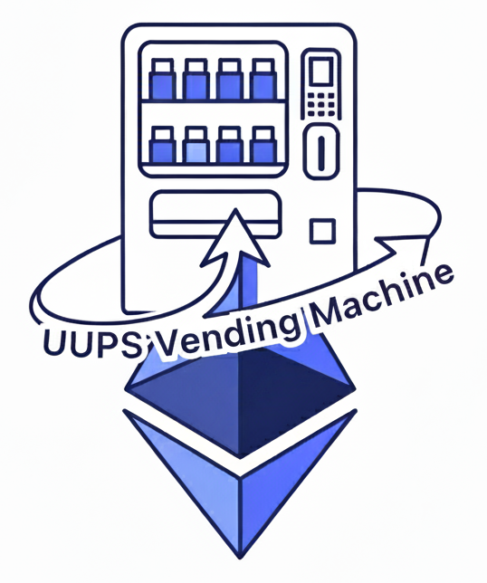

# UUPS VendingMachine V2 - Decentralized Vending Machine DApp

<div align="center">
  <table border="0" style="border: none;">
    <tr>
      <td align="center" style="border: none;">
        
      </td>
      <td align="left" style="border: none;">
        <h3>Project Overview</h3>
        <p>A complete Ethereum-based vending machine implementation featuring upgradeable smart contracts using UUPS pattern, admin interface, and comprehensive analytics dashboard.</p>
        <p>
          
          
          
          
          
        </p>
      </td>
    </tr>
  </table>
</div>

**Live Demo**: [https://astierfe.github.io/UUPS-VendingMachine/](https://astierfe.github.io/UUPS-VendingMachine/) - Try the DApp directly with a non-admin account on Sepolia testnet!

## Table of Contents

- [Why UUPS VendingMachine?](#why-uups-vendingmachine)
- [Features](#features)
- [UML Documentation](#uml-documentation)
- [Architecture](#architecture)
- [Installation & Setup](#installation--setup)
- [Usage Guide](#usage-guide)
- [Smart Contract Details](#smart-contract-details)
- [Acknowledgments](#acknowledgments)
- [Support](#support)

## Why UUPS VendingMachine?

### The Challenge
Traditional smart contracts face a fundamental limitation: immutability. While this ensures security and trust, it creates significant challenges for real-world applications that need to evolve, fix bugs, or add features. Businesses operating vending machines need flexibility to:
- Update product catalogs and pricing strategies
- Add loyalty programs and promotional features
- Fix bugs without losing customer data or funds
- Scale operations without costly redeployments

### Our Solution
UUPS VendingMachine addresses these challenges by implementing the Universal Upgradeable Proxy Standard (UUPS), providing:

- **Seamless Upgrades**: Deploy new features without changing contract addresses or losing state
- **Cost Efficiency**: Single proxy contract reduces gas costs compared to Transparent Proxy Pattern
- **Enhanced Security**: Upgrade logic embedded in implementation prevents proxy selector clashing
- **Business Continuity**: Zero downtime during upgrades maintains user trust
- **Future-Proof Architecture**: V3 and beyond can be deployed effortlessly

### Why UUPS Over Transparent Proxy?

| Feature | UUPS | Transparent Proxy |
|---------|------|-------------------|
| **Gas Costs** | ✅ Lower (no admin contract) | ❌ Higher (separate admin) |
| **Complexity** | ✅ Simpler architecture | ❌ More complex |
| **Security** | ✅ No selector clashing | ⚠️ Potential clashing |
| **Upgrade Logic** | ✅ In implementation | ❌ In separate admin |
| **OpenZeppelin Support** | ✅ Recommended since 2021 | ⚠️ Legacy pattern |

This project demonstrates enterprise-grade blockchain development with production-ready patterns that solve real business needs while maintaining the security and decentralization principles of Ethereum.

## Features

### V1 Core Features (Preserved)
- Product catalog with ETH-based payments
- Automatic refunds for overpayments
- Stock management with out-of-stock protection
- Owner-only fund withdrawal
- Complete transaction history

### V2 Enhanced Features
- **Admin Dashboard**: Complete CRUD operations for products
- **Advanced Analytics**: Sales tracking, revenue reports, time-based filtering
- **Permission System**: Role-based access control for admin functions
- **Event Logging**: Comprehensive blockchain event emission
- **Backward Compatibility**: All V1 functions preserved and enhanced

## UML Documentation

This project includes comprehensive UML diagrams documenting the complete architecture and functionality of the UUPS VendingMachine V2. All diagrams are available in high-quality SVG format for optimal viewing and printing.

### Architectural Diagrams

- [**System Architecture**](./uml_docs/UUPS-VendingMachine-V2_1-Architecture.svg) - Complete system overview with all components and their interactions
- [**Component Diagram**](./uml_docs/UUPS-VendingMachine-V2_2-Components_A4.svg) - Detailed component relationships and dependencies
- [**Deployment Diagram**](./uml_docs/UUPS-VendingMachine-V2_3-Deployment_A4.svg) - Infrastructure setup and deployment environments
- [**Class Diagram**](./uml_docs/UUPS-VendingMachine-V2_4-Classes.svg) - Smart contract structure and inheritance patterns
- [**Package Diagram**](./uml_docs/UUPS-VendingMachine-V2_5-packages-light.svg) - Code organization and module structure

### Behavioral Diagrams

- [**Upgrade Sequence V1→V2**](./uml_docs/UUPS-VendingMachine-V2_6-sequence-upgrade.svg) - UUPS upgrade process flow
- [**Purchase Sequence**](./uml_docs/UUPS-VendingMachine-V2_7-sequence-buy-product.svg) - Complete product purchase workflow
- [**Admin Activity**](./uml_docs/UUPS-VendingMachine-V2_8-activity-admin-light.svg) - Admin management workflows
- [**MetaMask State Machine**](./uml_docs/UUPS-VendingMachine-V2_9-state-metamask.svg) - Transaction state transitions
- [**Analytics Sequence**](./uml_docs/UUPS-VendingMachine-V2_11-sequence-analytics.svg) - V2 analytics and reporting system

### Use Case Diagrams

- [**Customer Use Cases**](./uml_docs/UUPS-VendingMachine-V2_10a-usecase-customer.svg) - End-user shopping experience
- [**Admin Use Cases**](./uml_docs/UUPS-VendingMachine-V2_10b-usecase-admin.svg) - Administrative management interface
- [**Owner Use Cases**](./uml_docs/UUPS-VendingMachine-V2_10c-usecase-owner.svg) - System-level administration

### Diagram Features

- **Professional Quality**: All diagrams follow UML 2.0 standards and best practices
- **A4 Optimized**: Designed for perfect printing on A4 paper (portrait/landscape)
- **SVG Format**: Vector graphics for infinite zoom without quality loss
- **Comprehensive Coverage**: Complete system documentation from architecture to user interactions
- **V2 Enhanced**: Highlights new features including admin interface, analytics, and UUPS upgrade patterns

## Architecture

### Smart Contract Structure

```
contracts/
├── VendingMachineV2.sol          # Main upgradeable contract
├── VendingMachineV1.sol          # Original implementation (for reference)
└── ProductLibrary.sol            # Shared utility functions
```

### Frontend Architecture

```
frontend/src/
├── App.jsx                       # Main application with admin routing
├── hooks/useContract.js          # Enhanced Web3 integration hook
├── utils/contract.js             # Contract interface utilities
└── components/
    ├── Admin.jsx                 # Complete admin dashboard
    ├── Header.jsx                # Enhanced header with admin indicators
    ├── Catalog.jsx               # Product catalog display
    ├── ProductCard.jsx           # Individual product components
    ├── PurchaseHistory.jsx       # User transaction history
    └── Footer.jsx                # Application footer
```

## Installation & Setup

### Prerequisites
- Node.js (v20.19.5+)
- npm (v10.8.2+)
- MetaMask /Rabby Wallet Browser extension
- Git

### Quick Start

```bash
# Clone the repository
git clone https://github.com/your-username/uups-vending-machine-v2.git
cd uups-vending-machine-v2

# Install dependencies
npm install

# Compile contracts
npx hardhat compile

# Run tests
npm test

#### Local

# Start local blockchain
npx hardhat node

# Deploy V1 (in another terminal)
npx hardhat run scripts/deploy.js --network localhost
npx hardhat run scripts/populate-product.js --network localhost

# Upgrade to V2
npx hardhat run scripts/deploy-v2.js --network localhost

# Start frontend
cd frontend
npm install
npm run dev
```

#### Sepolia

```bash
# Set up environment variables
cp .env.example .env
# Edit .env with your configuration

# Deploy V1 to Sepolia
npx hardhat run scripts/deploy.js --network sepolia

# Populate with sample products
npx hardhat run scripts/populate-product.js --network sepolia

# you can test the V1

# Upgrade to V2
npx hardhat run scripts/deploy-v2.js --network sepolia

# Verify contracts on Etherscan (optional)
npx hardhat verify --network sepolia CONTRACT_ADDRESS

# Update frontend configuration for Sepolia deployment
# Edit frontend/src/utils/contract.js with your deployed contract address
# Start frontend
cd frontend
npm install
npm run dev

```

## Usage Guide

### Planned V3 Features

- **DeFi Integration**: Yield generation on locked funds
- **NFT Loyalty Program**: Collectible rewards for frequent buyers
- **Cross-chain Support**: Multi-chain inventory synchronization
- **Dynamic Pricing**: Oracle-based pricing with market rates
- **DAO Governance**: Community-driven product selection
- **Payment Tokens**: Accept multiple ERC20 tokens
- **Subscription Model**: Monthly passes for regular customers

### Educational Use Cases

This project serves as an excellent educational resource for:

- **Smart Contract Development**: Learn UUPS patterns and best practices
- **Web3 Integration**: Complete frontend-to-blockchain interaction examples
- **Testing Strategies**: Comprehensive test suite as learning reference
- **Upgrade Patterns**: Real-world upgrade scenarios and migrations
- **Security Patterns**: Access control and permission management

### Contributing

We welcome contributions from the community! The UUPS architecture makes it easy to:

1. **Fork and Experiment**: Test new features without breaking existing functionality
2. **Submit Enhancements**: Add features through the upgrade mechanism
3. **Improve Documentation**: Help others learn from this project
4. **Report Issues**: Identify bugs or suggest improvements
5. **Share Educational Content**: Create tutorials or workshops

### Endless Possibilities

The modular UUPS architecture opens doors to countless innovations:

- **Vending Networks**: Connect multiple machines in a decentralized network
- **Supply Chain Integration**: Automatic restocking with IoT sensors
- **AI Recommendations**: Machine learning for personalized suggestions
- **Social Features**: Share purchases, gift products to friends
- **Gamification**: Achievements, leaderboards, and challenges
- **B2B Solutions**: White-label deployments for businesses
- **Mobile Apps**: Native iOS/Android apps with Web3 integration

## Smart Contract Details

### Contract Addresses

| Network | V1 Address | V2 Proxy Address | Status |
|---------|------------|------------------|--------|
| Localhost | Dynamic | Dynamic | Development |
| Sepolia | `0x...` | `0x...` | Testnet |

### Security Features

- **Access Control**: OpenZeppelin's Ownable implementation
- **Upgrade Safety**: UUPS pattern with authorization
- **Input Validation**: Comprehensive parameter checking
- **Reentrancy Protection**: Built-in safeguards

### Code Standards

- **Solidity Style**: Follow OpenZeppelin conventions
- **JavaScript**: ES6+ with proper JSDoc comments
- **Testing**: Minimum 95% code coverage
- **Documentation**: Update README for new features

## Acknowledgments

- **OpenZeppelin**: Upgradeable contract frameworks
- **Hardhat**: Development environment and testing
- **Ethers.js**: Ethereum interaction library
- **Chakra UI**: React component library
- **Alchemy**: Ethereum development bootcamp

## Support

For questions and support:

- **GitHub Issues**: [Create an issue](https://github.com/your-username/uups-vending-machine-v2/issues)
- **Documentation**: Check this README and inline code comments
- **Community**: Alchemy Discord server

---

**Project Status**: Production Ready  
**Last Updated**: September 2025  
**Version**: 2.0.0